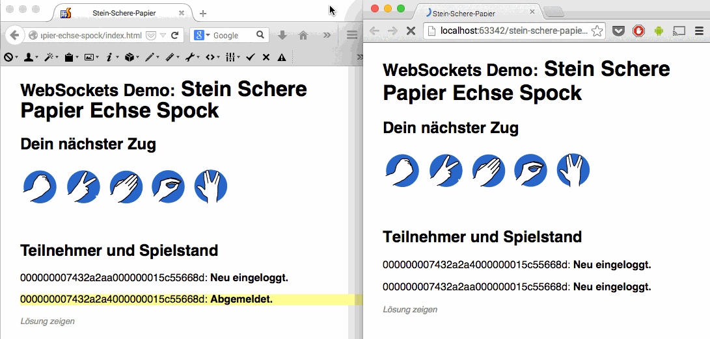

Stein-Schere-Papier-Echse-Spock
===============================

Implementation of stone scissors paper lizard spock with WebSockets

## How it looks




## Installation
Install composer
(see https://getcomposer.org/doc/01-basic-usage.md)

```
curl -sS https://getcomposer.org/installer | php
```

then

```
php composer.phar install
```

should install [Ratchet](https://github.com/ratchetphp/Ratchet) via Composer.

## Start

Start Webservice via PHP-CLI

```
php server.php
```

then open ``ìndex.html``` in two different browsers and play together! You'll see what the Websocket-Server is doing in the terminal.

**Have a detailed look into ```SteinScherePapier.class.php``` for the WebSocket-business-logic behind it.**

